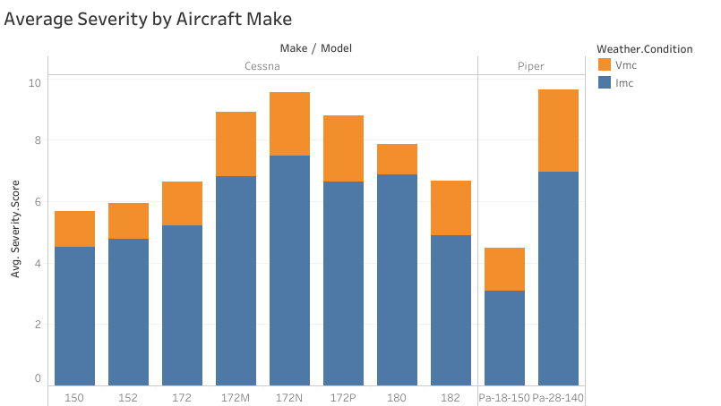
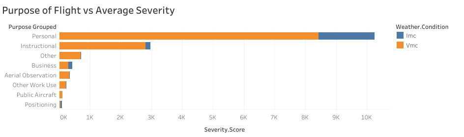

# Phase1-project


# Aviation Accidents Analysis

Analyze aviation accident data to identify low-risk aircraft and provide actionable business recommendations.


## Project Overview
This project explores aviation accident data from 1962–2023 (NTSB dataset) to determine which aircraft types are safest for commercial and private operations.  
Key goals:  
- Clean and standardize raw data  
- Analyze injury severity and accident trends  
- Provide actionable insights for aircraft purchase decisions  


## Dataset
- Source: [National Transportation Safety Board (NTSB)](https://www.kaggle.com/datasets/prathamsharma123/aviation-accidents-and-incidents-ntsb-faa-waas)  
- Key features: Make, Model, Number of Engines, Flight Purpose, Weather Conditions, Injury Counts, Event Date  


## Analysis Workflow
1. **Data Cleaning**: Handled missing values, standardized text, removed incomplete rows  
2. **Feature Engineering**: Created `Severity.Score` to quantify accident impact  
3. **Filtering**: Focused on most common aircraft makes, models, and flight purposes  
4. **Visualization**: Explored patterns and trends with charts and tables  


## Visualizations

The following visualizations support the analysis and business recommendations.

### 1. Severity Score by Aircraft Make
This visualization compares average accident severity across the most common aircraft manufacturers, helping identify lower-risk makes.




### 2. Number of Engines vs Accident Severity
This chart shows how accident severity varies between single-engine and multi-engine aircraft.


### 3.Severity by Purpose of flight
This visualization highlights how the purpose of flight affects the number of accidents




## Key Findings
1. Certain aircraft models consistently show lower severity scores → safer options  
2. Multi-engine configurations correlate with fewer severe accidents  
3. Flight purpose impacts risk; commercial flights tend to have lower severity than recreational flights  


## Files in This Repository
- `Aviation_Data.csv` – Raw data  
- `aviation_cleaned.csv` – Cleaned dataset   
- `index.ipynb` – Jupyter Notebook with full analysis  
- `presentation.pdf` – Non-technical slide deck for business stakeholders  
- `README.md` – Project overview  


## How to Open and Run the Project

Follow these steps to access, run, and explore the Aviation Accidents Analysis project:

1. **Clone the repository** to your local machine:
```bash
git clone <repository-url>
```
2. **Navigate to the project folder:**
```bash
cd <repository-folder>
```

3. **Open the Jupyter Notebook:**
```bash
code .
```
4. **Run all cells in the notebook to reproduce the analysis.**

5. **Explore the interactive Tableau dashboard:**
    You can view and interact with the dashboard here: 
    https://public.tableau.com/app/profile/alan.muchiri/viz/Project_Tableau_17659991069130/Dashboard1